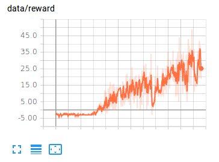

# Implementation of Relational Deep Reinforcement Learning

This Repository is implementation of [Relational Deep Reinforcement Learning](https://arxiv.org/pdf/1806.01830.pdf) to Breakout Environment.

The Reinforcement Learning Algorithm is [Proximal Policy Optimization](https://arxiv.org/abs/1707.06347)

## Configuration

* This paper requires heavy computation power.
* Left Figure is the map of attention which is produced by self-attention.
* Though the paper developed 100 environments for experiment, the implementer of this repository created only 16 environments with the limitation of computer resources. So sometimes it's exactly the performance and sometimes it's not.
* If you want to see more significant attention map, just control CNN function to have less strides and more filters. In this repository, 84, 84 images are processed to have 9, 9 because of my computation limit.

  
  

